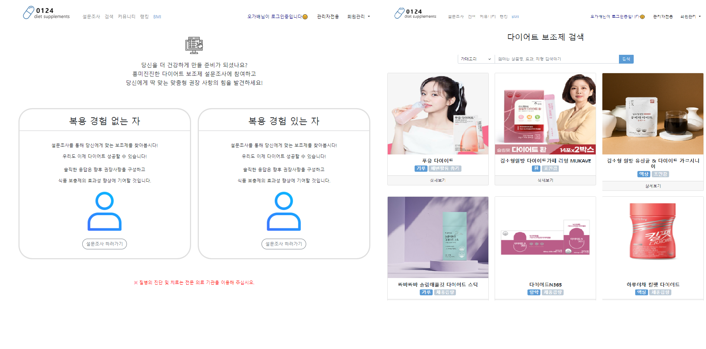
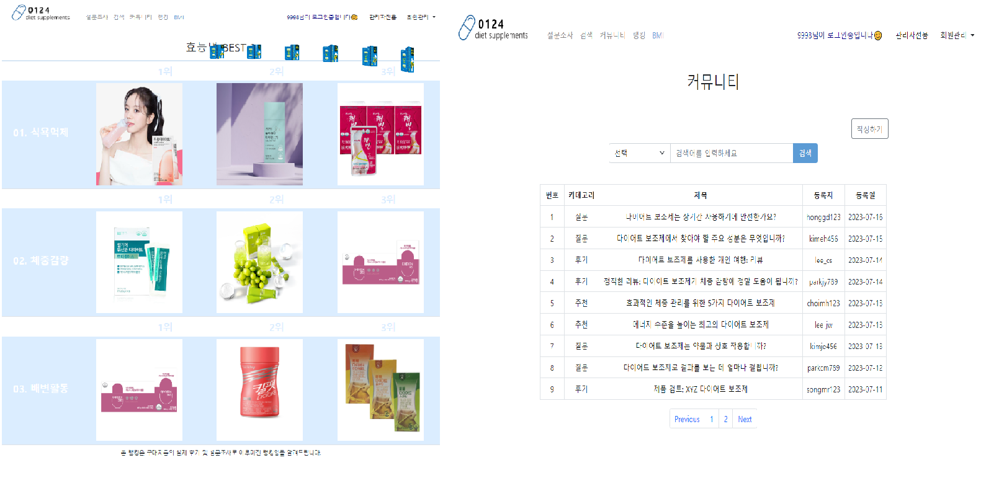

# '9998' Final Project

## 📃콘텐츠 : 다이어트 보조제 추천 사이트 

### ✔️프로젝트 설명
다이어트 보조체 추천 사이트를 만들어 달라는 의뢰를 받아 구현한 사이트 
사이트를 이용객의 설문조사를 기반한 순위를 통해 보조제를 추천받을 수 있으며 원하는 보조제를 검색할 수 있다. 
더불어 마이페이지, 관리자페이지를 통해 원활한 관리가 될 수 있게끔 구현하였다.

### ✔️사용 기술

         

### ✔️개발 기간

- 2023년 7월 7일~ 2023년 7월 31일

### ✔️구현 영상

- [다이어트 보조제 구현 영상](https://www.youtube.com/watch?v=eFJFn9SuabQ)

### ✔️구현 화면

 
 


### ✔️ERD

- [ERD](https://github.com/hhyowon/project_supplements/blob/main/Docs/Databases/ERD.png) 

### ✔️팀원 및 구현 기능

### 👩‍💻 김명곤

<details>
<summary>Sample Code</summary>

- [SecurityConfiguration.java](https://github.com/hhyowon/project_supplements/blob/main/src/main/java/com/example/project_supplements/configs/SecurityConfiguration.java)
- [SampleController.java](https://github.com/hhyowon/project_supplements/blob/main/src/main/java/com/example/project_supplements/controller/SampleController.java)
- [SampleService.java](https://github.com/hhyowon/project_supplements/blob/main/src/main/java/com/example/project_supplements/service/SampleService.java)
- [DietMapper.xml](https://github.com/hhyowon/project_supplements/blob/main/src/main/resources/sqlmapper/mysql/DietMapper.xml)
- [Header.jsp](https://github.com/hhyowon/project_supplements/blob/main/src/main/webapp/WEB-INF/views/etc/Header.jsp)
- [Footer.jsp](https://github.com/hhyowon/project_supplements/blob/main/src/main/webapp/WEB-INF/views/etc/Footer.jsp)
- [list_map_ex.jsp](https://github.com/hhyowon/project_supplements/blob/main/src/main/webapp/WEB-INF/views/etc/list_map_ex.jsp)
</details>

<details>
<summary>로그인</summary>

- [LoginController.java](https://github.com/hhyowon/project_supplements/blob/main/src/main/java/com/example/project_supplements/controller/LoginController.java)
- [SignController.java](https://github.com/hhyowon/project_supplements/blob/main/src/main/java/com/example/project_supplements/controller/SignController.java)
- [SignService.java](https://github.com/hhyowon/project_supplements/blob/main/src/main/java/com/example/project_supplements/service/SignService.java)

</details>

<details>
<summary>권한 설정 </summary>
  
 - [PrincipalUser.java](https://github.com/hhyowon/project_supplements/blob/main/src/main/java/com/example/project_supplements/security/PrincipalUser.java)
 - [PrincipalUserService.java](https://github.com/hhyowon/project_supplements/blob/main/src/main/java/com/example/project_supplements/security/PrincipalUserService.java)
 - [AuthsService.java](https://github.com/hhyowon/project_supplements/blob/main/src/main/java/com/example/project_supplements/service/AuthsService.java)
 - [SecurityConfiguraion.java](https://github.com/hhyowon/project_supplements/blob/main/src/main/java/com/example/project_supplements/configs/SecurityConfiguration.java)
  
</details>


### 👩‍💻 송명주

<details>
<summary>설문조사 통계</summary>

- [SurveryResultMapper.xml](https://github.com/HNNNY35/final_retoree/blob/master/src/main/resources/sqlmapper/mysql/LoginMapper.xml)
- [SurveyResultController.java](https://github.com/HNNNY35/final_retoree/blob/master/src/main/java/com/project/final_retoree/controller/LoginController.java)
- [SurveyResultService.java](https://github.com/HNNNY35/final_retoree/blob/master/src/main/java/com/project/final_retoree/services/RegisterService.java)

</details>

<details>
<summary>랭킹</summary>

- [SurveyRankMapper.xml](https://github.com/HNNNY35/final_retoree/blob/master/src/main/resources/sqlmapper/mysql/RegisterMapper.xml)
- [RankController.java](https://github.com/HNNNY35/final_retoree/blob/master/src/main/java/com/project/final_retoree/controller/RegisterController.java)
- [RankService.java](https://github.com/HNNNY35/final_retoree/blob/master/src/main/java/com/project/final_retoree/services/RegisterService.java)

</details>

<details>
<summary>마이페이지 설문 이력</summary>

- [UserInfoAdminMapper.xml](https://github.com/HNNNY35/final_retoree/blob/master/src/main/resources/sqlmapper/mysql/UserInfoAdminMapper.xml)
- [UserInfoAdminController.java](https://github.com/HNNNY35/final_retoree/blob/master/src/main/java/com/project/final_retoree/controller/UserInfoAdminController.java)
- [UserInfoAdminService.java](https://github.com/HNNNY35/final_retoree/blob/master/src/main/java/com/project/final_retoree/services/UserInfoAdminService.java)

</details>

<details>
<summary>관리자 페이지 설문 이력</summary>

- [UserInfoAdminMapper.xml](https://github.com/HNNNY35/final_retoree/blob/master/src/main/resources/sqlmapper/mysql/UserInfoAdminMapper.xml)
- [UserInfoAdminController.java](https://github.com/HNNNY35/final_retoree/blob/master/src/main/java/com/project/final_retoree/controller/UserInfoAdminController.java)
- [UserInfoAdminService.java](https://github.com/HNNNY35/final_retoree/blob/master/src/main/java/com/project/final_retoree/services/UserInfoAdminService.java)

</details>

### 👩‍💻 조효원

<details>
<summary>메인페이지</summary>

- [CheckPriceMapper.xml](https://github.com/HNNNY35/final_retoree/blob/master/src/main/resources/sqlmapper/mysql/CheckPriceMapper.xml)
- [MainController.java](https://github.com/HNNNY35/final_retoree/blob/master/src/main/java/com/project/final_retoree/controller/CheckPriceController.java)
- [CheckPriceService.java](https://github.com/HNNNY35/final_retoree/blob/master/src/main/java/com/project/final_retoree/services/CheckPriceService.java)

</details>

<details>
<summary>BMI 페이지</summary>

- [BmiMapper.xml](https://github.com/HNNNY35/final_retoree/blob/master/src/main/resources/sqlmapper/mysql/SearchMapper.xml)
- [BMIController.java](https://github.com/HNNNY35/final_retoree/blob/master/src/main/java/com/project/final_retoree/controller/SearchController.java)
- [BmiSerivce.java](https://github.com/HNNNY35/final_retoree/blob/master/src/main/java/com/project/final_retoree/services/SearchService.java)

</details>

<details>
<summary>다이어트 보조제 검색</summary>

- [SearchMapper.xml](https://github.com/HNNNY35/final_retoree/blob/master/src/main/resources/sqlmapper/mysql/DealerMapper.xml)
- [SearchController.java](https://github.com/HNNNY35/final_retoree/blob/master/src/main/java/com/project/final_retoree/controller/DealerController.java)
- [SearchService.java](https://github.com/HNNNY35/final_retoree/blob/master/src/main/java/com/project/final_retoree/services/DealerService.java)
</details>


<details>
<summary>관리자페이지 회원 관리</summary>

- [AdminMapper.xml](https://github.com/HNNNY35/final_retoree/blob/master/src/main/resources/sqlmapper/mysql/NoticeMapper.xml)
- [AdminController.java](https://github.com/HNNNY35/final_retoree/blob/master/src/main/java/com/project/final_retoree/controller/NoticeController.java)
- [AdminService.java](https://github.com/HNNNY35/final_retoree/blob/master/src/main/java/com/project/final_retoree/services/NoticeService.java)

</details>

<details>
<summary>관리자페이지 보조제 관리</summary>

- [AdminProductMapper.xml](https://github.com/HNNNY35/final_retoree/blob/master/src/main/resources/sqlmapper/mysql/NoticeMapper.xml)
- [AdminProductsController.java](https://github.com/HNNNY35/final_retoree/blob/master/src/main/java/com/project/final_retoree/controller/NoticeController.java)
- [AdminProductsService.java](https://github.com/HNNNY35/final_retoree/blob/master/src/main/java/com/project/final_retoree/services/NoticeService.java)

</details>


### 👩‍💻 오가배 

<details>
<summary>설문조사 진행 페이지</summary>

- [SurveyMapper.xml](https://github.com/hhyowon/project_supplements/blob/main/src/main/resources/sqlmapper/mysql/SurveyMapper.xml)
- [SurveyController.java](https://github.com/hhyowon/project_supplements/blob/main/src/main/java/com/example/project_supplements/controller/SurveyController.java)
- [SurveyService.java](https://github.com/hhyowon/project_supplements/blob/main/src/main/java/com/example/project_supplements/service/SurveyService.java)

</details>

<details>
<summary>커뮤니티</summary>

- [CommunityMapper.xml](https://github.com/hhyowon/project_supplements/blob/main/src/main/resources/sqlmapper/mysql/CommunityMapper.xml)
- [CommunityController.java](https://github.com/hhyowon/project_supplements/blob/main/src/main/java/com/example/project_supplements/controller/CommunityController.java)
- [CommunityService.java](https://github.com/hhyowon/project_supplements/blob/main/src/main/java/com/example/project_supplements/service/CommunityService.java)
</details>

<details>
<summary>마이페이지 회원정보 수정 </summary>

- [MypageMapper.xml](https://github.com/hhyowon/project_supplements/blob/main/src/main/resources/sqlmapper/mysql/MypageMapper.xml)
- [MypageController.java](https://github.com/hhyowon/project_supplements/blob/main/src/main/java/com/example/project_supplements/controller/MypageController.java)
- [MypageService.java](https://github.com/hhyowon/project_supplements/blob/main/src/main/java/com/example/project_supplements/service/MypageService.java)

</details>

<details>
<summary>마이페이지 커뮤니티 관리 </summary>

- [MypageMapper.xml](https://github.com/hhyowon/project_supplements/blob/main/src/main/resources/sqlmapper/mysql/MypageMapper.xml)
- [MypageController.java](https://github.com/hhyowon/project_supplements/blob/main/src/main/java/com/example/project_supplements/controller/MypageController.java)
- [MypageService.java](https://github.com/hhyowon/project_supplements/blob/main/src/main/java/com/example/project_supplements/service/MypageService.java)

</details>

<details>
<summary>관리자 페이지 커뮤니티 관리 </summary>

- [AdminCommunityMapper.xml](https://github.com/hhyowon/project_supplements/blob/main/src/main/resources/sqlmapper/mysql/AdminCommunityMapper.xml)
- [AdminCommunityControll.java](https://github.com/hhyowon/project_supplements/blob/main/src/main/java/com/example/project_supplements/controller/AdminCommunityControll.java)
- [AdminCommunityService.java](https://github.com/hhyowon/project_supplements/blob/main/src/main/java/com/example/project_supplements/service/AdminCommunityService.java)

</details>

### ✔️주요코드 및 진행 통해 느낀 점

### 👍 김명곤

```
    String[] imgFiles = {"Front", "Side", "Inside", "Tire", "Navi", "Trunk"};
    int idx = 0;


     * 이미지파일 insert
    attachfile = new HashMap<>();
    attachfile.put("ATTACHFILE_SEQ", commonUtils.getUniqueSequence());
    attachfile.put("SOURCE_UNIQUE_SEQ", params.get("CAR_ID"));
    attachfile.put("ORIGINALFILE_NAME", originalFileName);
    attachfile.put("PHYSICALFILE_NAME", physicalFileName);
    attachfile.put("IMG_INFO", imgFiles[idx]);
    idx = idx + 1;

    attachfiles.add(attachfile);


     * 이미지파일 select
    String[] imgFiles = {"Front", "Side", "Inside", "Tire", "Navi", "Trunk"};

    for(int i = 0; i < imgFiles.length; i++) {
      ((Map<String, Object>) dataMap).put("IMG_INFO", imgFiles[i]);
      result = carDetailDao.getOne(sqlMapId, dataMap);
      String fileName = (String)(((Map<String, Object>)result).get("ORIGINALFILE_NAME"));

      results.put(imgFiles[i], fileName);
      }


```
모여서 회의하다가 강사님이 부르시길래 내가 다녀올게~ 하고 나갔다가 로또 5등에 당첨이 되지 않는 제가 백엔드에 당첨되었습니다.
내가.. 내가 백엔드라니.. 내가 백엔드라니!! 으아니!! 내가 백엔드라니!!!!!
아무고토 모르는 내가 백엔드라 걱정이 많이 되었지만 마른 오징어도 짜면 물이 나온다고
하다보니 되더라구요.
일단 해! 라는 마인드가 중요했습니다.
하나씩 해결해 나가는 우리 팀을 보면서 가아아아아아끔 재밌었고 나머지는 스트레스에 연속이었습니다.
하지만 우리 조원들이 많이 도와줘서 프로젝트 1차 완료 할 수 있었습니다.
....
...
..
.
그만 하고 싶다ㅋ

### 👍 송명주

```
    @Override
    public Collection<? extends GrantedAuthority> getAuthorities() {

        Collection<GrantedAuthority> collections = new ArrayList<>();
        String authority = (String) userInfo.get("AUTH");
        if (StringUtils.hasText(authority)) {
            collections.add(new SimpleGrantedAuthority(authority));
        } else {
            collections.add(new SimpleGrantedAuthority("ROLE_ANONYMOUS"));
        }
        return collections;
    }
```

로그인을 위해 시큐리티를 적용할 때 인증된 사용자가 가진 권한 정보를 collections에 담아 반환하는 과정에서 오류가 발생하여 구현하는 데에 있어 시간이 상당히 걸리게 되었습니다. 그리하여 if문을 사용하여 권한 정보가 존재하는 경우 권한 정보를 collections에 추가하고 권한 정보가 존재하지 않는 경우 기본 권한 정보를 collections에 추가하여 인증된 사용자의 권한 정보를 포함하는 Collection을 반환하는 방법을 사용하여 구현해 낼 수 있었습니다.

코드를 구현하다 보면 나 자신이 구현한 코드밖에 알지 못해 구현 방식에 한계가 생길 수밖에 없는데 팀원들이 구현한 다양한 방식의 코드를
보면서 "이걸 이런 식으로 구현할 수가 있구나", "이렇게도 가능하구나"라며 다시 한번 배울 수 있었던 기회가 되었고 평소에 전혀 알지 못했던 사용방식, 기능들을 파이널프로젝트를 통해 알게 되어 매우 의미 있는 시간이 되었으며 팀원들과 함께 협동하여 코드를 공유하며 오류를 잡아 구현되지 않았던 코드들이 구현되어 화면에 출력되는 것에 매우 뿌듯하였으며 힘이 들었던 만큼 만족스러운 결과물을 얻게 되어 더욱 나 자신을
한층 성장시키게 되었던 기간이었던 거 같다.

### 👍 조효원

```

            for( Map<String, Object> list :(ArrayList<Map<String, Object>>)resultMap){
                Map<String, Object> car_id = new HashMap<>();
                car_id.put("SOURCE_UNIQUE_SEQ", list.get("CAR_ID"));
                Object carImgs = searchService.selectCarImg(car_id);
                (((ArrayList<Map<String, Object>>)resultMap).get(i)).put("carImgs", (Map<String, Object>)carImgs);
                i++;
            }

```

리투리 프로젝트에서 검색과 시세 기능을 맡았습니다. 제가 생각했던 구현의 중점은 여러 테이블로 분리된 대량의 데이터를 분류하고 가져오는 것이었습니다. 하지만 프로젝트를 완료하면서 불러온 차량 데이터에 대한 이미지 경로를 처리하는 과정에서 불필요한 데이터베이스 호출이 많아져서 성능이 저하되었다는 것이 아쉬웠습니다. 이러한 문제가 발생한 이유는 처음부터 자바 코드를 작성할 때, SQL 문을 고려하지 않았기 때문입니다. 이러한 문제를 사전에 고려하고 SQL 문에서 한 번의 호출로 처리하는 방법을 고려했다면, 성능 저하 문제를 방지할 수 있었을 것입니다. 이번 프로젝트를 통해서 코드를 작성하기 위해 더 다양한 상황에 대한 대처와 고려점이 필요하다고 느꼈습니다.

### 👍 오가배

```
        List surveyMapList = new ArrayList<Map>();
        for (String questionId : dataMap.keySet()) {
            Map<String, String> questionAnswerMap = new HashMap<>();
            String answerId = (String) dataMap.get(questionId);
            questionAnswerMap.put("QuestionId", questionId);
            questionAnswerMap.put("AnswerId", answerId);
            questionAnswerMap.put("SURVEY_ID", this.generateUUID());
            surveyMapList.add(questionAnswerMap);
        }
        dataMap.put("surveyMapList", surveyMapList);
        // 부모테이블 값 insert 먼저 시키기 
        String SURVEY_UID = UUID.randomUUID().toString(); 
        dataMap.put("USER_ID", commons.getUserID()); // user_id 받기
        dataMap.put("SURVEY_UID", SURVEY_UID);
        dataMap.put("DATE_TIME", new SimpleDateFormat("yyyy-MM-dd HH:mm:ss").format(new Date()));
        String sqlMapId = "SurveyService.insertsurveyresult";
        Object result01 = sharedDao.insert(sqlMapId, dataMap);

        // 자식테이블 insert

        dataMap.put("SURVEY_TYPE_ID", "F-01");
        sqlMapId = "SurveyService.insertsurvey";
        Object resultMap = sharedDao.insert(sqlMapId, dataMap);
        //String uuid = this.generateUUID();
        return dataMap;

```

설문조사 결과값을 DB에 넣는 과정에서 NAME과 VALUE값을 효율적으로 연결하는 법과 DB에 INSERT를 시키기 위해서는 
부모테이블을 먼저 insert를 시켜야 자식테이블에 insert가 가능하다는 점을 확실히 인지하였습니다. 
더불어 참조 받은 fk값인 SURVEY_UID는 UUID로 받는데 동일한 UUID임을 인지시켜줘야 부모테이블 및 자식테이블이 insert가 된다는 점을 통해 
ERD를 명확하게 이해해야 나머지 코드를 조금 더 수월하게 진행해 나갈 수 있음을 알게 되었습니다. 
마지막으로 팀원분들과 원활한 소통 덕분에 조금 더 빠르고 효율적으로 프로젝트를 진행해 나갈 수 있었음에 감사드립니다!! 
